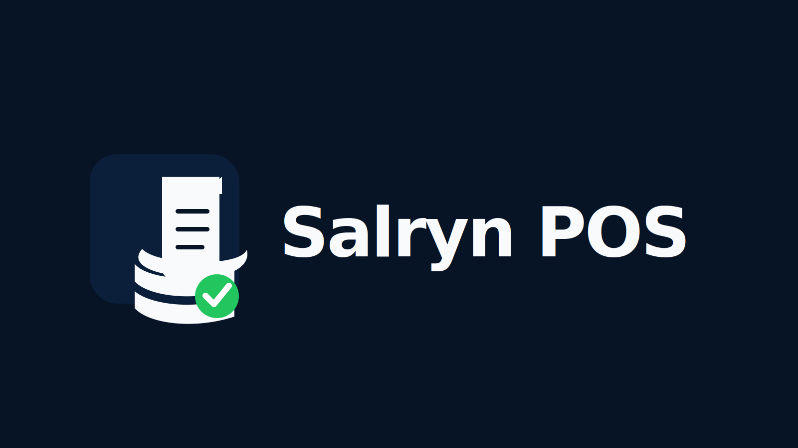

<p align="center">
  
</p>

<h1 align="center">Salryn POS</h1>

<p align="center">
  <strong>Offline-ready point-of-sale software for small stores.</strong>
</p>

<p align="center">
  Track your sales. Track your inventory. Save your receipts. Keep selling even without internet.
</p>

---

## Overview

**Salryn POS** is a Windows point-of-sale system made for small stores that need a simple, modern, and practical way to manage daily sales and inventory.

It helps store owners process sales, track products, record stock movements, review sales history, save receipts, export records, and create backups from one local store system.

**No internet is needed for daily store use.**

Internet may be needed for downloading the installer, updates, setup help, or support services.

---

## What You Can Do With Salryn POS

- Process store sales
- Track products and inventory
- Record stock-in and stock adjustments
- View sales history
- Monitor daily, weekly, and monthly sales
- Save receipt files locally
- Reprint saved receipts
- Export audit records
- Create backups
- Add supported extra terminals for cashier or light store workflows

---

## Why Salryn POS

Many small stores still rely on notebooks, calculators, spreadsheets, or older-looking POS systems.

Salryn POS gives small stores a modern Windows app for daily store operations:

```text
Sell products.
Track inventory.
Review sales.
Save receipts.
Back up store data.
Keep operating even without internet.
```

---

## Pricing

### Salryn Standard

```text
₱20,000 one-time
```

For **1 store / 1 host workstation**.

Includes:

- POS checkout
- Product catalog
- Inventory tracking
- Stock-in and stock adjustment
- Sales history
- Sales dashboard
- Receipt file saving
- Receipt reprint support
- Audit export
- Backup and restore support
- Windows app installation

---

### First 10 Clients Launch Price

```text
₱15,000 one-time
```

Available only for the first 10 client stores.

This includes the same Salryn Standard software package for 1 store / 1 host workstation.

---

### Additional Terminal Access

```text
₱4,000 one-time per additional terminal
```

Additional Terminal Access allows another supported device on the same local network to access selected Salryn workflows.

Supported use cases may include:

- Extra cashier terminal
- Tablet-based cashier workflow
- Phone or tablet access for light store use
- Manager or sales review access

The Windows host computer remains the main store system.

---

### Software Only

Salryn POS pricing is for software only.

Hardware such as computers, barcode scanners, printers, routers, tablets, phones, and UPS units are not included unless separately quoted.

---

## Recommended Setup

### Single Workstation Setup

Best for small stores using one computer as the main POS station.

Recommended:

```text
Windows 10 or Windows 11, 64-bit
Intel Core i3 6th gen or newer
8 GB RAM
128 GB SSD
1366×768 screen or better
Stable power source
```

---

### Host + Additional Terminal Setup

Best for stores that want one main host computer and extra cashier or review devices.

Recommended host:

```text
Windows 10 or Windows 11, 64-bit
Intel Core i5 8th gen or newer
16 GB RAM
256 GB SSD
Stable wired or Wi-Fi local network
UPS recommended
```

Additional terminals may use supported Windows devices, phones, or tablets depending on the setup and workflow.

---

## Data Storage

Salryn POS stores local runtime data on the store computer.

Important data may include:

- Local database
- Receipts
- Backups
- Exports
- Logs
- Configuration
- License state

Do not delete the Salryn data folder unless instructed during support.

---

## Included Features

### Sales

- POS checkout
- Cash payment flow
- Sales history
- Receipt review
- Receipt reprint
- Daily sales visibility

### Inventory

- Product catalog
- Barcode/SKU support
- Unit of measure support
- Stock-in
- Stock adjustment
- Low-stock visibility
- Stock movement review

### Reports and Records

- Dashboard
- Sales summary
- Audit records
- CSV export
- Receipt files

### Store Safety

- Backup support
- Restore support
- Local data storage
- Installer-based Windows app setup

### Expansion

- Additional terminal access
- Supported phone or tablet access for selected workflows
- Local network setup for store use

---

## What Is Not Included by Default

Salryn POS Standard does not automatically include:

- POS hardware
- Printer hardware
- Barcode scanner hardware
- Cash drawer hardware
- BIR accreditation processing
- eSales submission service
- Payment gateway integration
- Multi-branch sync

These may be discussed separately depending on the client's requirements.

---

## Download

The Windows installer is distributed through this repository's **GitHub Releases** page.

Download the latest Salryn POS setup file from Releases, run the installer, then open **Salryn POS** from the desktop shortcut.

---

## Credits

**Product:** Salryn POS  
**Publisher:** Kirjane Labs

**Team:**

- **Paul Gamayot** — Business Lead
- **Kirch Ivan Balite** — Technology Lead
- **Jesse Edwin Culas** — Marketing Lead
- **James Karl Tara** — Business Development
- **Osiris Kedigadash Palac** — DevOps Lead

© 2026 Kirjane Labs. All rights reserved.

---

## Contact

For inquiries, setup, pricing, and support:

```text
salryn.info@gmail.com
```

---

## Repository Notice

This public repository is for Salryn POS product documentation and release distribution. The application source code is maintained separately by Kirjane Labs.
