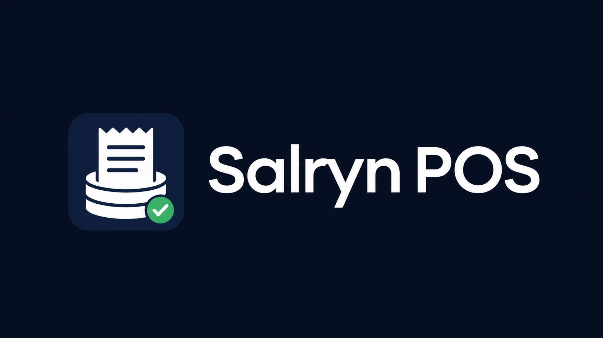

<p align="center">
  
</p>

<h1 align="center">Salryn POS</h1>

<p align="center">
  Offline-first point-of-sale software for small stores, built by <strong>Kirjane Labs</strong>.
</p>

<p align="center">
  <strong>Install locally. Sell faster. Track inventory. Keep receipts. Own your store data.</strong>
</p>

---

## Overview

**Salryn POS** is a Windows point-of-sale system designed for small-store operations. It runs locally, keeps store data on the device, and provides the core tools needed to manage products, inventory, checkout, receipts, audit logs, backups, and local licensing.

Salryn is built for practical daily use: open the app, manage products, record stock, complete sales, save receipts, and back up the store database without depending on a cloud dashboard for normal operation.

---

## Download

The Windows installer is published through this repository's **GitHub Releases** page.

**Current installer:**

```text
Salryn-POS-BetaRC1-Setup.exe
```

**SHA-256:**

```text
9f6e583ca5d3d8a4754b476849ed9590595535fc93aba19054d44ac278834d6c
```

---

## Installation

1. Download the installer from the latest GitHub Release.
2. Run `Salryn-POS-BetaRC1-Setup.exe`.
3. Follow the setup wizard.
4. Open **Salryn POS** from the desktop shortcut.

Default install location:

```text
C:\Program Files\Kirjane Labs\Salryn POS
```

Runtime data location:

```text
C:\ProgramData\Salryn
```

Do not delete `C:\ProgramData\Salryn`. It stores the local database, receipts, backups, exports, logs, configuration, and license state.

---

## Main Features

### Point of Sale

- Local checkout workflow
- Cash payment flow
- Completed sale confirmation
- Saved receipt file per sale
- Sales and receipt review
- Receipt reprint path
- New-sale separation after checkout

### Product Catalog

- Product creation and editing
- Barcode/SKU support
- Product price fields
- Unit of measure handling
- Stock tracking option
- Low-stock visibility

### Inventory

- Stock-in workflow
- Stock adjustment workflow
- Stock movement history
- Inventory-safe checkout stock-out behavior
- Product details separated from quantity changes

### Receipts

- Client-facing sales receipt format
- Receipt number
- Local date and time
- Human cashier name
- Item lines
- Subtotal, total, cash, change, and payment method
- Receipt files stored under ProgramData

### Store Operations

- Dashboard
- Today, week, and month sales summaries
- Sales and receipt detail review
- Reports page
- Store settings
- User/admin surfaces

### Audit and Backup

- Audit viewer
- Audit CSV export
- Backup creation
- Restore support
- Runtime data stored outside the install folder

### Licensing

- Local license flow
- License state stored outside the install folder
- Installer does not ship signing secrets, private keys, generated license fixtures, or local store databases

---

## Data Ownership

Salryn POS keeps operational store data locally under:

```text
C:\ProgramData\Salryn
```

This keeps day-to-day POS use independent from a required cloud service. Backups should be created regularly from inside the app and stored safely.

---

## Included Windows App Experience

- Windows installer
- Desktop shortcut
- Start Menu shortcut
- Salryn POS desktop app window
- Packaged WebView2 loader
- No browser URL typing for normal use
- No PowerShell for normal client use

---

## Credits

**Product:** Salryn POS  
**Publisher:** Kirjane Labs

**Team:**

- **Paul Gamayot** — Business Lead
- **Kirch Ivan Balite** — Technology Lead
- **Jesse Edwin Culas** — Marketing Lead
- **James Karl Tara** — Business Development
- **Osiris Kedigadash Palac** — DevOps Lead

© 2026 Kirjane Labs. All rights reserved.

---

## Support

For installation help, support, or business inquiries:

```text
salryn.info@gmail.com
```

---

## Repository Notice

This public repository is for Salryn POS product documentation and release distribution. The application source code is maintained separately by Kirjane Labs.
